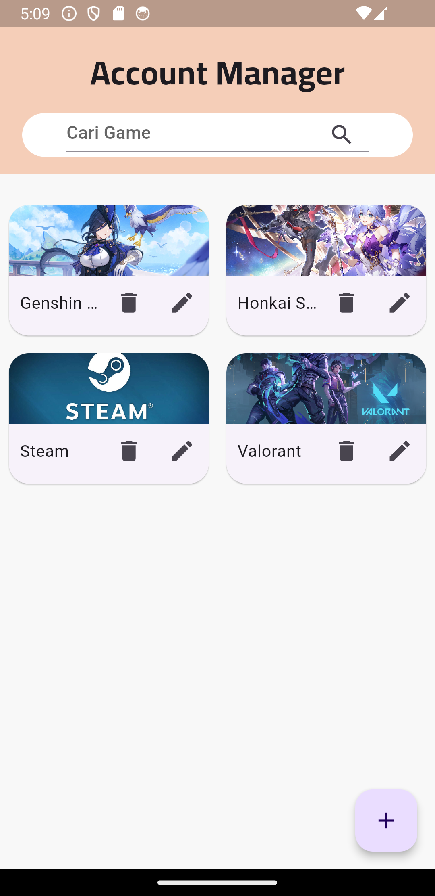
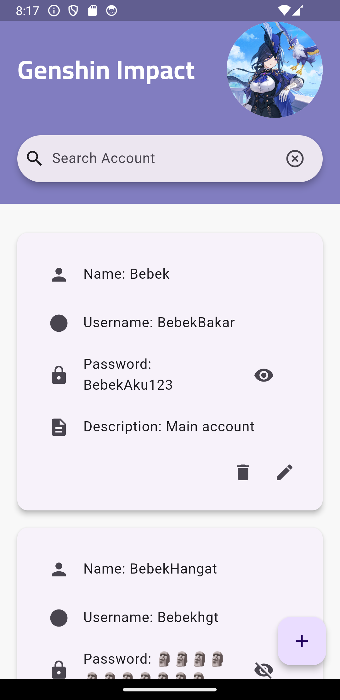

# Secure Account Manager

Secure Account Manager is a mobile application for securely storing game usernames and emails offline using a local database.

## Features

- Securely store game usernames and emails.
- Offline database support for data security.

## Installation

To install Secure Account Manager, follow these steps:

1. Clone the repository:
git clone https://github.com/username/repository-name.git
cd repository-name


2. Install dependencies:
- For Flutter projects:
  ```
  flutter pub get
  ```

3. Run the application on your emulator or device:
- For Flutter projects:
  ```
  flutter run
  ```

## Contributing

Contributions are welcome! Please fork the repository and submit pull requests.

## License

This project is licensed under the MIT License. See the [LICENSE](LICENSE) file for details.


 
